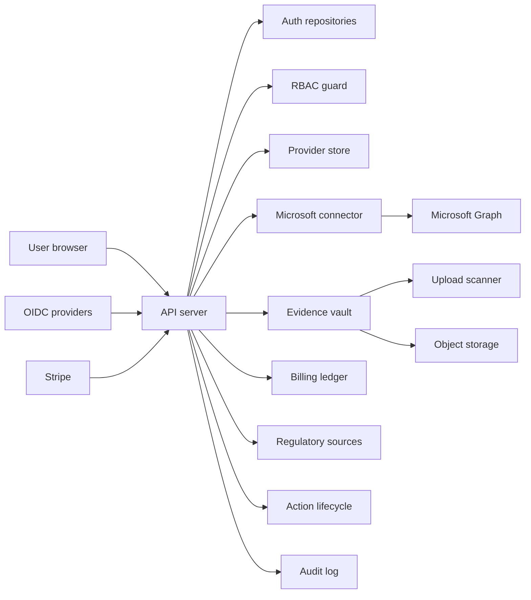

# PureSOC Threat Model

Date: 2026-05-01  
Scope: implemented product surfaces under `code/`, plus security-relevant docs and milestones.  
Status: M14 release-readiness threat model. Assumptions were inferred from repository docs and were not separately confirmed by the user during this implementation run.

## Executive summary

PureSOC is a multi-tenant compliance platform that handles high-value assets: user sessions, provider OAuth tokens, provider raw payloads, regulatory activation state, billing webhooks, evidence files, reports, and remediation approvals. The highest risk themes are cross-organization access, credential or storage-pointer leakage, unsafe future provider writes, and integrity compromise in regulatory or billing workflows. M14 fixed concrete issues in session cookie configuration, evidence API response redaction, regulatory review-task scoping, and remediation snapshot binding.

## Scope and assumptions

In scope:

- Runtime API surfaces in `code/apps/api/src`.
- Auth/session, OIDC callback, RBAC, provider connection, evidence, report, billing, remediation, and regulatory-source packages under `code/packages`.
- Adapter and in-memory implementations used by current tests.

Out of scope:

- Host, network, cloud account, CI, Kubernetes, and production secret-manager hardening unless product code depends on it.
- Legal correctness of regulatory content.
- Live Microsoft Graph, Stripe, OIDC, MinIO/S3, PostgreSQL, or scanner smoke tests beyond current contract tests.

Assumptions:

- API routes are intended to be internet-reachable behind TLS in SaaS mode and locally reachable in in-a-box mode.
- Browser clients authenticate with the `puresoc_session` cookie.
- Current runtime still uses many in-memory repositories in tests; Prisma/live database wiring is deferred.
- Provider writes remain disabled until GAP-030 runtime safety work exists.
- Evidence files may contain sensitive compliance documents, provider snapshots, audit exports, and generated reports.

Open questions that could change risk ranking:

- Exact production ingress and TLS termination model.
- Whether browser clients will call same-origin API only or cross-origin API with CORS.
- Maximum expected evidence upload size and tenant count per deployment.

## System model

### Primary components

- API server and routes: `code/apps/api/src/server.ts`, route modules under `code/apps/api/src/*/routes.ts`.
- Auth/session services: `code/packages/auth/local/src/index.ts`, `code/packages/auth/oidc/src/index.ts`.
- RBAC guard: `code/apps/api/src/rbac/index.ts`.
- Provider storage and Microsoft connector: `code/packages/providers/core/src/storage.ts`, `code/packages/providers/microsoft365/src/index.ts`, `code/packages/providers/microsoft365/src/crypto.ts`.
- Evidence vault and report export: `code/packages/evidence/src/index.ts`, `code/apps/api/src/evidence/routes.ts`, `code/apps/api/src/reports/service.ts`.
- Billing: `code/apps/api/src/billing/service.ts`, `code/packages/billing/stripe/src/index.ts`.
- Remediation action safety: `code/packages/recommendations/src/actions.ts`, `code/apps/api/src/actions/routes.ts`.
- Regulatory source activation: `code/packages/regulatory-sources/src/index.ts`, `code/apps/api/src/regulatory-sources/routes.ts`.

### Data flows and trust boundaries

- Browser -> API server: JSON bodies, cookies, OIDC callback params, evidence content; HTTP. Auth by session cookie for tenant routes, JSON parsing in `parseJsonBody`, RBAC in `requireOrganizationRole`; no global body-size limit yet.
- API server -> auth repositories: email/password inputs, session hashes, OIDC identities; in-memory contract now, Prisma later. Passwords are Argon2id-hashed and session tokens are SHA-256-hashed.
- API server -> provider store: connection metadata, encrypted credentials, raw provider payloads, findings; service-layer organization checks in `ProviderResourceStore`.
- API server -> object storage/scanner: evidence bytes, content hashes, scanner result metadata; storage adapters enforce org-scoped object keys, scanners can fail closed in production.
- Stripe -> API webhook: raw webhook bytes and `Stripe-Signature`; HMAC verification and replay tolerance in `createStripeBillingProvider`.
- API server -> audit sink: security events and metadata; `AuditWriter` redacts key names containing token/password/secret/cookie/authorization/access/storageUri.
- API server -> regulatory activation service: review decisions and activation actions; M14 scopes task mutation and traceability reads to the route organization.
- API server -> remediation action lifecycle: action templates, preflight, approvals, snapshots, queue metadata; no provider executor exists yet.

#### Diagram

## Assets and security objectives

| Asset | Why it matters | Security objective |
|---|---|---|
| Session tokens and OIDC callback state | Account takeover enables tenant data access | C/I |
| Local password hashes and reset/verification token hashes | Credential compromise and unauthorized account recovery | C/I |
| Microsoft provider OAuth tokens | Cloud tenant read access and future write risk | C/I |
| Provider raw payloads | May contain users, roles, apps, alerts, and tenant posture | C/I |
| Evidence artifacts and generated reports | Sensitive compliance and audit material | C/I/A |
| Object storage URIs and internal keys | Can aid object enumeration or leakage if exposed | C |
| Regulatory source activation state | Incorrect legal logic can affect customer obligations | I |
| Billing webhooks and entitlements | Revenue and feature-gating integrity | I/A |
| Remediation approvals and snapshots | Future write safety depends on integrity | I |
| Audit logs | Detection, accountability, incident reconstruction | I/C |

## Attacker model

### Capabilities

- Remote unauthenticated attacker can hit public auth, OIDC callback, country-pack status, Romania draft/classification, and Stripe webhook endpoints.
- Authenticated low-privilege user can attempt cross-organization access by guessing IDs.
- Tenant admin can upload evidence, create reports, initiate provider connections, and attempt malformed action/regulatory workflows within their role.
- External providers can return malformed JSON, throttling, missing permissions, or error payloads.

### Non-capabilities

- Attacker cannot read server memory, bypass TLS termination, or obtain Stripe/OIDC/Microsoft secrets unless a separate infrastructure compromise occurs.
- Attacker cannot execute live provider write actions in current code because no executor is implemented and write actions remain gated.

## Entry points and attack surfaces

| Surface | How reached | Trust boundary | Notes | Evidence |
|---|---|---|---|---|
| Local auth register/login/session/logout | Browser POST/GET | Internet -> API -> auth repo | Argon2id, rate limiting, hashed sessions | `code/apps/api/src/auth/routes.ts`, `code/packages/auth/local/src/index.ts` |
| OIDC begin/callback | Browser GET/POST | IDP/browser -> API | state, nonce, PKCE, signature validation, explicit account linking | `code/packages/auth/oidc/src/index.ts` |
| Provider connections/sync | Tenant API routes | API -> provider store/Microsoft Graph | org-scoped connection checks, encrypted token payloads | `code/apps/api/src/provider-connections/*`, `code/packages/providers/*` |
| Evidence upload/download/list | Tenant API routes | API -> scanner/object storage | M14 hides `storageUri` from API responses | `code/apps/api/src/evidence/routes.ts`, `code/packages/evidence/src/index.ts` |
| Report generation/export | Tenant API routes | API -> stored analysis/evidence | reports built from stored analysis and caveat enforced | `code/apps/api/src/reports/service.ts`, `code/packages/reports/src/builders.ts` |
| Stripe webhook | Public POST | Stripe -> API -> billing ledger | raw-body HMAC and tolerance window | `code/packages/billing/stripe/src/index.ts` |
| Remediation action lifecycle | Tenant API routes | API -> action repository | preflight, approval, snapshot, queue metadata | `code/packages/recommendations/src/actions.ts` |
| Regulatory review activation | Tenant API routes | API -> regulatory source store | M14 scopes task actions/read traceability to org | `code/apps/api/src/regulatory-sources/routes.ts` |

## Top abuse paths

1. Cross-tenant ID probing -> attacker guesses another tenant's regulatory review task -> attempts review/activation -> could activate or expose source maps. M14 blocks this by organization-scoping task actions and traceability reads.
2. Evidence metadata leakage -> authorized user receives internal `storageUri` -> object key/bucket details leak into logs or clients -> attacker uses leaked infrastructure detail in later attacks. M14 removes `storageUri` from evidence API responses.
3. Session theft over non-TLS deployment -> cookie lacks `Secure` -> network attacker captures session -> tenant access. M14 wires `PURESOC_AUTH_COOKIE_SECURE` into issued and cleared cookies.
4. Forged billing webhook -> attacker posts fake subscription update -> entitlements enabled or disabled. Existing HMAC signature verification mitigates this; live Stripe operations remain deferred.
5. OIDC account-link abuse -> attacker signs in with same email from a provider -> links to existing account. Existing logic requires signed-in explicit approval and provider subject matching.
6. Unsafe future remediation -> attacker forges snapshot for another provider connection -> action appears ready to queue. M14 rejects provider-connection mismatch on action snapshots.
7. Oversized upload/request -> attacker submits very large JSON/evidence content -> memory pressure or service degradation. No route-level body/upload limit exists yet; track as release hardening gap.
8. Provider raw payload secret leakage -> connector error or raw resource contains tokens -> logs/API expose secrets. Existing provider/audit redaction covers sensitive key names, but live-provider payload review remains required.

## Threat model table

| Threat ID | Threat source | Prerequisites | Threat action | Impact | Impacted assets | Existing controls | Gaps | Recommended mitigations | Detection ideas | Likelihood | Impact severity | Priority |
|---|---|---|---|---|---|---|---|---|---|---|---|---|
| TM-001 | Authenticated cross-tenant user | User has any tenant membership and guesses another tenant ID/resource ID. | Access, mutate, or activate resources outside their org. | Tenant data disclosure or integrity compromise. | Evidence, reports, regulatory decisions, provider data. | RBAC guard in `rbac/index.ts`; provider/evidence stores check org. M14 added regulatory task/source-map scoping. | Need live Prisma query scoping tests for every persisted adapter. | Keep adding organization-scoped repository tests; consider RLS once runtime DB boundaries settle. | Alert on 403/404 spikes for tenant routes and mismatched org IDs. | Medium | High | High |
| TM-002 | Network attacker or XSS-assisted attacker | Session cookie transmitted without Secure in production or stolen from browser. | Reuse session token. | Account takeover within session lifetime. | Sessions, tenant data. | HttpOnly and SameSite=Lax in `http.ts`; session hashes in auth repo. M14 wired Secure cookie config. | Need deployed cookie/SameSite/CORS smoke. | Set `PURESOC_AUTH_COOKIE_SECURE=true` for TLS deployments; add production config validation. | Audit unusual IP/user-agent changes per session. | Medium | High | High |
| TM-003 | Authorized tenant user, log reader, or client-side leak | Evidence API returns internal storage pointers. | Capture object key/bucket URI and use it for enumeration or support/log leakage. | Evidence location disclosure and operational leakage. | Evidence artifacts, object storage layout. | Object adapters enforce org-scoped reads. M14 removes `storageUri` from API responses and marks it sensitive for audit response checks. | Live object storage IAM smoke still deferred. | Keep storage URIs server-only; expose downloads only through audited API. | Monitor evidence download/access-log volume. | Medium | Medium | Medium |
| TM-004 | External attacker | Can POST to Stripe webhook route but lacks webhook secret. | Forge billing event. | Entitlement integrity loss. | Billing ledger, entitlements. | Raw-body HMAC verification and timestamp tolerance in `billing/stripe/src/index.ts`; idempotent ledger. | Live Stripe endpoint/retry reconciliation is deferred. | Keep webhook secret rotation documented; add live Stripe test-mode smoke. | Alert invalid signature rate and duplicate event spikes. | Low | High | Medium |
| TM-005 | Malicious user or compromised IdP account | Existing email in PureSOC and external provider identity. | Attempt OIDC sign-in/link to existing account. | Account takeover if email alone were trusted. | User identity, sessions. | OIDC state/nonce/PKCE/signature validation and explicit signed-in account-link approval in `auth/oidc/src/index.ts`. | Live provider redirect/cookie smoke deferred. | Production OIDC app registration smoke and secret rotation runbook. | Audit `account_link_rejected` and failed callbacks. | Medium | High | High |
| TM-006 | Tenant operator or future worker bug | Action run reaches queue path with incomplete or forged safety evidence. | Queue unsafe provider write. | Cloud tenant misconfiguration or lockout once writes exist. | Provider tenant, action approvals, evidence. | Current lifecycle requires preflight, approval, pre-state snapshot, write-enabled connection; no live executor. M14 binds snapshots to the action provider connection. | GAP-030 live worker/provider execution remains open. | Before writes: persisted queue, idempotent worker, provider-specific preflight/snapshot/apply/verify tests. | Audit action queue/fail/verify transitions and alert executable action attempts. | Low now, Medium later | High | High |
| TM-007 | Regulatory admin mistake or attacker with regulatory_admin | Review task belongs to another org or source logic is not reviewed. | Review/activate wrong source version. | Incorrect customer guidance and auditability loss. | Regulatory source versions, country packs, source maps. | Review lifecycle prevents auto-activation of legal changes; M14 scopes task mutation/read by org. | Legal reviewer procedure/UI still open in GAP-006. | Product/legal review SOP and activation UI before production use. | Audit review/activation events and alert cross-org 404 attempts. | Medium | Medium | Medium |
| TM-008 | Remote or authenticated uploader | Large request body or evidence content. | Memory/CPU exhaustion during JSON parse, base64 decode, scanning, or hashing. | API availability degradation. | API, scanner, object storage. | Scanner fail-closed in production for unclean scans; no size limit yet. | Request/evidence size limits missing. | Add route-level max body size, evidence max bytes, streaming upload path, scanner timeout. | Metrics for request size, upload duration, scanner failures. | Medium | Medium | Medium |

## Criticality calibration

- Critical: remote pre-auth code execution; cross-tenant data exfiltration at scale; plaintext provider token leakage; unaudited provider write execution. Example: evidence download bypass across organizations.
- High: session takeover; OIDC account-link bypass; unsafe remediation queue with write-enabled provider connection; regulatory activation by the wrong organization.
- Medium: internal object key leakage; billing webhook operational gap with strong existing signature control; upload/request DoS without data compromise.
- Low: low-sensitivity metadata leakage, fixture-only issues, or attacks requiring developer/test-only access.

## Focus paths for security review

| Path | Why it matters | Related Threat IDs |
|---|---|---|
| `code/apps/api/src/server.ts` | Central route dispatch, raw-body handling, and request parsing. | TM-001, TM-004, TM-008 |
| `code/apps/api/src/http.ts` | Cookie issuance, JSON parsing, response secret checks. | TM-002, TM-008 |
| `code/packages/auth/local/src/index.ts` | Password hashing, login rate limit, session creation. | TM-002 |
| `code/packages/auth/oidc/src/index.ts` | State, nonce, PKCE, signature validation, account linking. | TM-005 |
| `code/apps/api/src/rbac/index.ts` | Organization-role enforcement for tenant APIs. | TM-001 |
| `code/packages/providers/core/src/storage.ts` | Provider resource tenant isolation and raw payload storage. | TM-001, TM-008 |
| `code/packages/providers/microsoft365/src/crypto.ts` | Provider token encryption envelope. | TM-008 |
| `code/apps/api/src/evidence/routes.ts` | Evidence metadata response boundary and download authorization. | TM-003 |
| `code/packages/evidence/src/index.ts` | Upload scanning, object storage scoping, evidence access logs. | TM-003, TM-008 |
| `code/packages/billing/stripe/src/index.ts` | Stripe signature validation and secret handling. | TM-004 |
| `code/packages/recommendations/src/actions.ts` | Remediation state machine and future write safety gates. | TM-006 |
| `code/packages/regulatory-sources/src/index.ts` | Source review, activation, source-map traceability integrity. | TM-007 |

## M14 fixes completed

- Wired `PURESOC_AUTH_COOKIE_SECURE` / legacy `AUTH_COOKIE_SECURE` into issued and cleared session cookies.
- Removed internal evidence `storageUri` from evidence upload/list/download API responses.
- Added `storageUri` to audit/response sensitive-key checks.
- Scoped regulatory review task review/reject/activate actions and source-map traceability reads to the route organization.
- Rejected remediation action snapshots whose provider connection differs from the action run provider connection.

## Quality check

- Entry points discovered in API routes are represented above.
- Each trust boundary is represented by at least one threat.
- Runtime behavior is separated from live deployment and CI/host hardening.
- Assumptions are explicit; user clarifications were not collected in this run.
- Existing mitigations and M14 changes are tied to repo paths and symbols.
